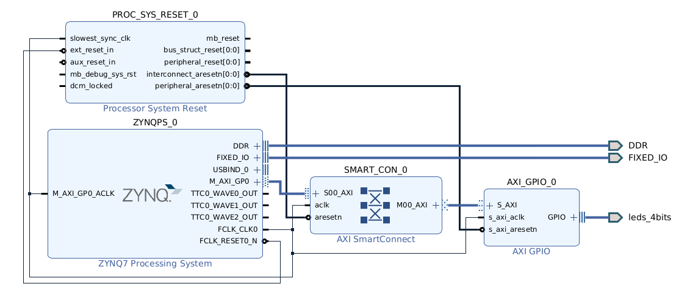
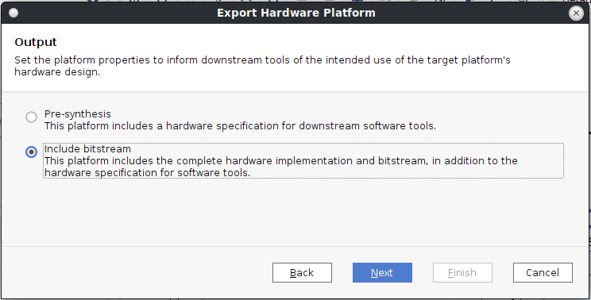
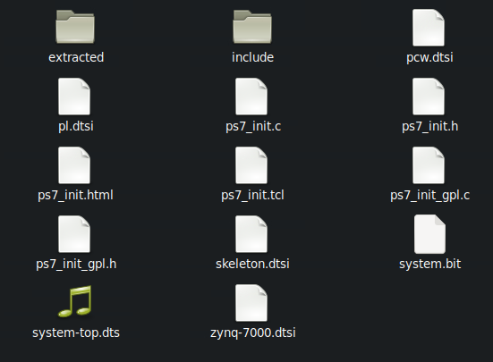

# ZedBoard PetaLinux BSPs for Vivado 2024.2+
New PetaLinux is nice because it runs on RHEL and it has a newer kernel. Unfortunately, there is no official ZedBoard BSP for the newer PetaLinux, so we have to make one ourselves.

**You can download the BSP from the releases and directly create a petalinux-project with it...**
```bash
$ wget https://github.com/ubfx/zedboard-bsp/releases/download/2024.2/zedboard-2024.2.bsp
$ petalinux-create project -s zedboard-2024.2.bsp -n zedboard-2024.2
```
**... and continue with step [Build](#Build).**

Or you can manually create the BSP as described in the following section.

**Note about device-tree generation:** In the past, the device-tree would be generated by calling `xsct` which generated several `*.dts` files which are then compiled using `dtc`, all within the Yocto/PetaLinux recipes. Xilinx is now moving away from this approach and is using an "SDT" flow instead. This flow generates the device tree outside of Yocto/PetaLinux, e.g. from within Vitis or manually via `sdtgen` commands. Then, only the `dtc` based device-tree compilation happens within the actual Yocto/PetaLinux recipes. I'm using the new SDT flow here because there seems to be no point in sticking with the old approach. The old approach is however still supported for a few releases (according to Xilinx), so if you need to stick with that for some reason, you can adapt the tutorial below accordingly. Basically, the difference is that you leave out the `sdtgen` steps and supply `petalinux-config --get-hw-description` with the `.xsa` file acquired from the "Export Hardware" step in Vivado.

## Creating a BSP for current Vivado

Obviously, you first have to download and install the current PetaLinux version, which we don't describe here.

Then, download the most recent official ZedBoard BSP. They can be found by going to the PetaLinux download archive on the Xilinx/AMD Website, where for every PetaLinux version there are some BSPs for different Boards to download. However, the most recent PetaLinux that lists a ZedBoard BSP seems to be 2021.1.
[Download](https://www.xilinx.com/member/forms/download/xef.html?filename=avnet-digilent-zedboard-v2021.1-final.bsp)

The .bsp is really just a tar archive, so instead of using it with PetaLinux directly, we can unpack it to some folder as a reference.

```
tar xf avnet-digilent-zedboard-v2021.1-final.bsp
```

First step is now to open the Vivado project contained in that bsp/archive with the Vivado version matching PetaLinux version, and updating the project to that version. There might be a message about IP versions being out of date, also update those. Then save the project under a new name (I chose zedboard-2024.2) and generate bitstream.

The blockdiagram can remain unchanged from the original BSP, but of course you can also make project-dependent changes.



Then export the Hardware by going to File->Export->Hardware and export it including the bitstream



Next we will use the new SDT flow to generate device tree data from the xsa file we just exported. For that, run the `xsct` tool from command line (this tool comes with the Vivado/Vitis installation). After the `-xsa`, put the path to the xsa file that you just exported from Vivado.
```
$ xsct                                                                                                                                                                                                                                    ─╯                                                                                                                                                                                                       

xsct% sdtgen set_dt_param -dir zed2024_out_sdt -xsa zedboard_2024.2/system.xsa -board_dts zedboard                                                                                     
xsct% sdtgen generate_sdt  
```

This should have generated a folder `zed2024_out_sdt` which we can now use as Hardware description for PetaLinux. You might have to adapt the path to the generated sdt in the following commands. The folder contents shoud look something like this:



Now we can create the PetaLinux project.

```bash
$ petalinux-create project  --template zynq -n zedboard-2024.2
$ cd zedboard-2024.2/
$ petalinux-config --get-hw-description zed2024_out_sdt --silentconfig
```

You can now make changes to the overall PetaLinux configuration or rootfs (i.e. included packages etc), but you can also leave everything at default. Note: Don't copy the configuration files from the old BSP because the available settings and options don't match perfectly. If you really care, you can diff `config` and `rootfs_config` files between the newly generated project and the old BSP.
```bash
$ petalinux-config #optional
$ petalinux-config -c rootfs #optional
```

Now copy these files from the old BSP to the new petalinux project
* project-spec/meta-user/recipes-kernel/linux/linux-xlnx/bsp.cfg
* project-spec/meta-user/recipes-bsp/device-tree/files/*.dtsi

That's it, you should now be able to build the project and create the boot image.

## Build
```bash
$ petalinux-build
```

This should create all the binaries in the `images/` folder.

## Create boot image
```bash
$ petalinux-package boot --plm --psmfw --u-boot --dtb --fsbl --fpga  --force
[INFO] Getting Default bit file
[INFO] File in BOOT BIN: "zedboard-2024.2/images/linux/zynq_fsbl.elf"
[INFO] File in BOOT BIN: "zedboard-2024.2/project-spec/hw-description/system.bit"
[INFO] File in BOOT BIN: "zedboard-2024.2/images/linux/u-boot.elf"
[INFO] File in BOOT BIN: "zedboard-2024.2/images/linux/system.dtb"
[INFO] Generating zynq binary package BOOT.BIN...
[INFO] 

****** Bootgen v2024.2
  **** Build date : Oct 21 2024-10:58:34
    ** Copyright 1986-2022 Xilinx, Inc. All Rights Reserved.
    ** Copyright 2022-2024 Advanced Micro Devices, Inc. All Rights Reserved.


[INFO]   : Bootimage generated successfully
```

## Flash
Follow [this tutorial](https://xilinx.github.io/vmk180-trd/2020.2/platform3/html/build-plnx.html#create-an-sd-card-image) to create a bootable SD card image.
